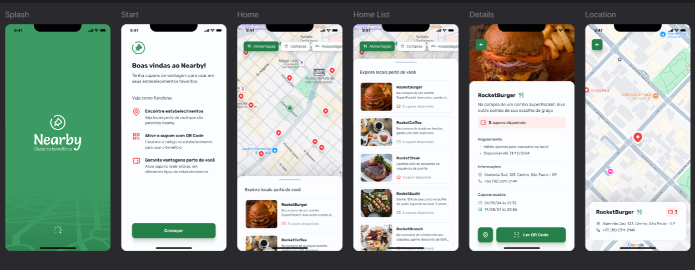

<p align="center">
  <h1 align="center">NLW Pocket Mobile • Nearby 🚀</h1>
</p>

## 💻 Sobre

O projeto é um aplicativo mobile de clube de benefícios com cupons para utilizar em estabelecimentos próximos a você.

Este é um projeto do evento NLW Pocket Mobile, um dos conteúdos disponíveis para alunos da Rocketseat.
___

## 🎨 Layout
Imagens da aplicação são vistas na imagem abaixo:




___

## 🛠 Tecnologias

As seguintes tecnologias foram empregadas na criação deste projeto:

- [React Native](https://reactnative.dev/)
- [TypeScript](https://www.typescriptlang.org/)
- [Expo Router](https://docs.expo.dev/router/introduction/)
- [Tabler Icons](https://tabler.io/docs/icons/react-native)
- [React Native Maps](https://github.com/react-native-maps/react-native-maps)

___

## 🚀 Como utilizar

Clone o projeto para o local desejado em seu computador.

```bash
$ git clone https://github.com/Brunogodoy2911/Nearby

# Navegue até o diretório
$ cd Nearby

# Instale as dependências necessárias
$ npm install

# Agora inicie a aplicação - Um QR Code será exibido no Terminal
$ npx expo start

# Em seu celular, instale o aplicativo Expo Go - Ele é gratuito na Play Store.

# Abra o Expo Go que acabou de instalar, e então escaneie o QR Code através do aplicativo.

# A aplicação então será exibida de forma 100% funcional diretamente em seu celular.

Made with ❤️ by Bruno Henrique de Godoy 👋🏽 [Get in Touch!](https://www.linkedin.com/in/bruno-godoy-07806726b/)
